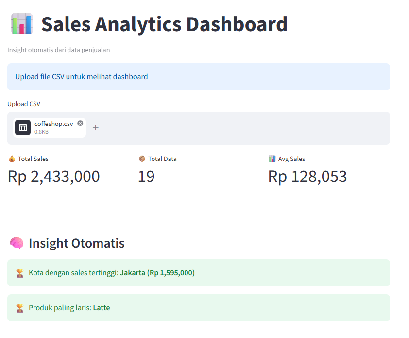

````md
# 📊 Sales Dashboard Project

Dashboard analisis penjualan interaktif menggunakan Python dan Streamlit.

---

# ✨ Features

- Upload file CSV penjualan
- Data cleaning otomatis
- Filter data berdasarkan:
  - Tanggal
  - Produk
  - Kota / Region
- KPI Cards:
  - Total Sales
  - Total Orders
  - Average Order Value
  - Profit
- Visualisasi interaktif:
  - Sales Trend
  - Top Products
  - Sales by Category
  - Regional Performance
- Download cleaned data
- Responsive dashboard UI

---

# 🛠️ Tech Stack

- Python
- Streamlit
- Pandas
- Plotly

---

# 📂 Project Structure

```bash
sales-dashboard/
│
├── app.py                # Main Streamlit dashboard
├── cleaning.py           # Data cleaning process
├── requirements.txt      # Python dependencies
├── sample_data.csv       # Example dataset
└── README.md
````

---

# 🚀 Installation

## 1. Clone Repository

```bash
git clone https://github.com/irmanj/sales-dashboard
cd sales-dashboard
```

## 2. Create Virtual Environment

```bash
python -m venv venv
```

Activate environment:

### Windows

```bash
venv\Scripts\activate
```

### Mac/Linux

```bash
source venv/bin/activate
```

---

# 📦 Install Dependencies

```bash
pip install -r requirements.txt
```

---

# ▶️ Run Dashboard

```bash
streamlit run app.py
```

Open browser:

```bash
http://localhost:8501
```

---

# 📈 Dataset Format

Example columns:

| Order Date | Product | Category    | Sales | Profit | Region  |
| ---------- | ------- | ----------- | ----- | ------ | ------- |
| 2025-01-01 | Laptop  | Electronics | 1200  | 250    | Jakarta |

---

# 🧹 Data Cleaning Process

Dashboard automatically:

* Removes duplicate rows
* Handles missing values
* Converts date columns
* Standardizes text formatting
* Cleans numeric values

---

# 📸 Dashboard Preview
```markdown

```

---

# ☁️ Deployment

Deploy easily using Streamlit Cloud.

## Deploy Steps

1. Push project to GitHub
2. Open Streamlit Cloud
3. Connect repository
4. Deploy app

---

# 🔗 Live Demo

Example:

```text
https://sales-dashboard-0.streamlit.app//
```

---

# 💼 Use Cases

Suitable for:

* Business monitoring
* Sales reporting
* Portfolio projects
* Client dashboard projects
* Data analyst portfolio

---

# 👨‍💻 Author

Created by Irma Nur Jayanti

LinkedIn:

```text
https://www.linkedin.com/in/irma-nur-jayanti/
```

---